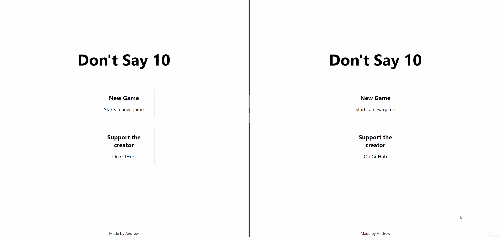

# Not 10

Don't say 10, the game

Rules:

1. You can add 1, 2, or 3 to the total every turn
2. Whoever says 10 (or above) first loses, ie don't say 10

## Screenshot

## Running

* `yarn install` for dependencies
* make `.env` at the top level and populate with `DATABASE_URL=URL_HERE` where `URL_HERE` is the url of the prisma postgres DB connection (see [youtu.be/aim8Mk-ETK0?t=689](https://youtu.be/aim8Mk-ETK0?t=689))
* `yarn dev` to run locally

## Uses

- Nextjs
- websockets
- Prisma (ORM)

## TODO

* ~~JWT?~~ (Too lazy keke)

## Notes

Websockets don't work too well with nextjs even with SSR - it's recommended to run a separate express server and let next do the static site generating (this also applies to local dev although u can restart the server to apply websocket changes)

As such this cannot work on vercel even if environment variables are added

## License

